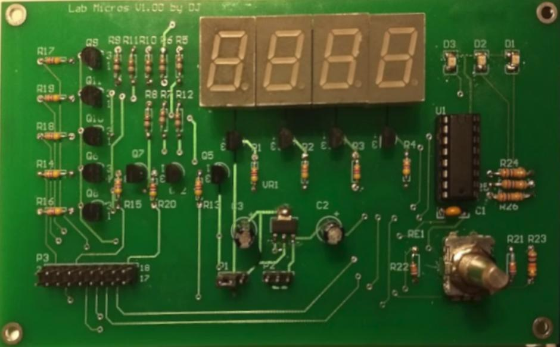

# 25.27 - Sistemas Embebidos

# TRABAJO PRÁCTICO N° 1

## INTERRUPCIONES

**Se desea implementar el control de acceso a un edificio de oficinas mediante
una tarjeta magnética y un pin (clave de acceso). Para lograr el objetivo se
dispone de encoder rotativo, un** **_display_** **de siete segmentos y un lector de
tarjetas magnéticas.**

	

---

### **Requerimientos obligatorios**

Para ingresar a una oficina el usuario debe ingresar su número de identificación (ID)
y, en caso de tener acceso, debe ingresar su clave (PIN) para validar su identidad.

El ID es un número de 8 dígitos que puede ingresarse usando el encoder o con la
tarjeta magnética. El PIN es una clave entre 4 y 5 dígitos que solo se puede ingresar
usando el encoder rotativo. Solo si el ID y PIN son correctos, se debe activar el
pestillo eléctrico (emulado por un LED de la placa) durante 5 segundos.

El usuario debe poder corregir errores de escritura, cancelar el intento de acceso y
cambiar la intensidad del _display_ con el encoder.

El ID debe ser visible en el _display_ mientras que los caracteres del PIN tienen que
estar ocultos (por ejemplo, ser reemplazados por guiones).

### **Requerimientos deseados**

El equipo debe ser robusto para evitar el acceso a personal no autorizado. Para esto
se deben implementar medidas de seguridad, por ejemplo: volver a estado inicial tras
inactividad, retardo luego de ingresar una clave incorrecta, bloqueo del acceso de ese
ID tras 3 intentos consecutivos incorrectos, etc.

El uso del equipo debe sencillo e intuitivo. Se valorará una interfaz gráfica cómoda
(animación del _display_ , indicación de tanto números como letras, velocidad de
parpadeo y color del LED RGB de la FRDM-K64F).

Se debe permitir, en modo administrador, agregar nuevos usuarios o eliminar
usuarios existentes. A su vez, los usuarios deben poder modificar su clave.

### **Implementación**

El programa debe estar implementado utilizando una arquitectura que tenga bien
definida la capa de aplicación y capa drivers, siendo el hardware transparente a la
capa aplicación.

Se debe hacer uso eficiente de las interrupciones de hardware y de la CPU. No se
deben perder eventos de usuario y se debe evitar el uso de código bloqueante. Para
la capa aplicación se recomienda implementar una FSM para manejo de los estados
del equipo.

Se debe agregar un pin de testeo (TP) que se encienda mientras se ejecutan las
interrupciones, a fin de medir el tiempo que se emplea en la ISR y cuánto representa
porcentualmente.

### **Conexionado**

Cada equipo dispondrá de una placa Encoder-Display y un lector de banda magnética.

Se deberá analizar el circuito de conexionado a partir del esquemático. **Es muy
importante considerar los niveles de tensión (5V y/o 3.3V), dirección y
polaridad de las señales (entrada o salida, activo bajo o alto)**.
Estudiar la estructura de datos utilizada en las tarjetas magnéticas y el protocolo de
comunicación de datos a partir de la hoja de datos de Magtek y de la norma ISO IEC
7811 - 2.

### **Evaluación**

Para la nota del trabajo contemplará en orden los siguientes puntos:

1. Funcionamiento obligatorio: Cumplimiento de los requerimientos obligatorios.
2. Implementación: Correcta arquitectura, diseño de drivers, uso correcto de la
   CPU e interrupciones.
3. Funcionamiento deseado: Robustez, uso intuitivo y versatilidad.
4. Presentación: Explicación de la estructura del programa, manual de usuario
   del equipo, claridad en la explicación, etc.
